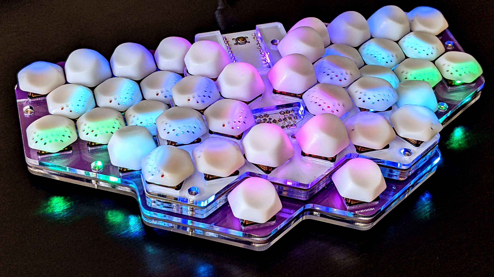
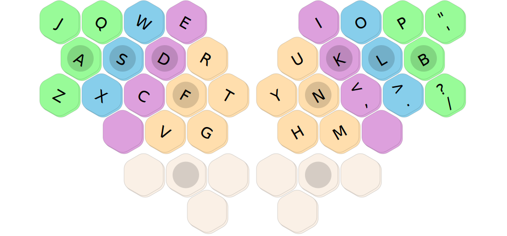

# Mantis hex ergo keyboard

>
>_Finished v0.3 prototype with RGB backlight and simulated key wells using two types of keycaps_

## Contents

This repository contains Ergogen, KiCad and OpenSCAD files for the PCB and case design and key caps, as well as this readme with some basic information. Mantis is approaching the end of the prototyping phase, currently at version is v0.3.3. You can check the git history for older prototype versions.

Mantis v0.3 consists of three PCBs. Two identical bottom PCBs are reversible. The top PCB is stacked on top with M2 standoffs and headers to create an approximation of two tented, shallow key wells together with the sculpted 3D printed key caps and the rotation of switches. Thank you to [PCBWay](https://www.pcbway.com/) for sponsoring the PCB and key cap production for my prototypes since v0.2.

v0.3 also includes DXF files for laser-cut plates. My prototype build uses 3mm thick acrylic plates for all layers, manufactured at Hot Pop Factory in Toronto. I'm also about to build some v0.3.3 builds with 3mm birch plywood plates.

## Build Guide

A complete build guide for v0.3.3 is in progress. Caveat: I have not tested the latest 0.3.3 PCB revision yet. Meanwhile, here is a full parts:

- 1x upper PCB
- 2x lower PCBs
- 40x custom 3D printed keycaps (FK Keycaps Hex keys also work but not ideal)
- Case plates (3mm. If different thickness is used, you may need to use different headers and standoffs)
    - 1x base plate
    - 1x lower sound plate
    - 1x lower switch plate
    - 2x upper sound plate
    - 1x upper switch plate
- 1x ProMicro or pin-compatible controller
- 1x Logic Level Inverter / Level Shifter (74AHCT14, only need for RGB with 3.3V controllers)
- 1x reset switch
- 40x SMD diodes (SOD-123)
- Up to 40 LEDs (SK6812 MINI-E)
- 40x Choc v1 switches
- Headers: (8mm headers work if you mount the male headers from the bottom of the lower PCB, pushing the pins all the way through. 5mm short headers sold by AdaFruit would be less janky)
    - 2x 12-pin headers for controllers
    - 2x 3-pin, 1x 8-pin, 1x 6-pin headers for connecting the upper and lower PCBs
- 12x 3mm knurled M2 male-female standoffs
- 6x 9mm knurled metal M2 male-female standoffs (don't use plastic standoffs, they are needed to connect GND between the PCBs)
- 12x M2 screws
- 12x M2 hex nuts
- Adhesive rubber feet

### Optional components

The reset switch is optional. You can reset the controller for loading new firmware by shorting the GND and RST pins with a paper clip or a short wire or by adding a RESET key to your keymap.

The case plates are optional. If you're building Mantis without a case you also don't need the 3mm standoffs. Just put rubber feet directly on the lower PCB. Make sure to support the center of the keyboard with rubber feet to avoid unnecessary stress on the split bottom PCBs.

The chaining of LEDs enables a few options for populating RGB LEDs:

- None
- 6: top center keys only
- 16: all keys on the upper PCB
- 40: all keys

The 74AHCT14 level shifter is only needed if you use RGB LEDs with a controller that uses 3.3V logic. The original ProMicro with 5V logic does not need a level shifter. Just bridge the jumper for directly connecting the LEDs to the controller pin.

### Keycap recommendations

I created two types of keycaps:

- [Flat with 15° tilt](https://github.com/fxkuehl/mantis/blob/main/keycap/keycap-v2-15-solid.stl) for most keys (24 keys per keyboard)
- [Tall with 28° tilt and flattened top](https://github.com/fxkuehl/mantis/blob/main/keycap/keycap-v3-28-solid.stl) for top row and some of the thumb keys (16 keys per keyboard)

The two links above take you to the STL files to use for 3D printing. There are [additional](https://github.com/fxkuehl/mantis/blob/main/keycap/keycap-v2-15.stl) [variants](https://github.com/fxkuehl/mantis/blob/main/keycap/keycap-v3-28.stl) with small holes for letting LEDs shine through. Light resin keycaps are translucent enough without the holes. But they are needed if you want to see RGB lights with black resin, nylon or other opaque plastic keycaps.

There are also STL files that combine 10 keycaps in a single STL model, which may allow cheaper printing with some manufacturers, depending on their minimum per-part cost. This may negatively affect the quality of the print. See [this article](https://kbd.news/Mantis-keycaps-2157.html) for more details.

It is possible to build an entire keyboard with only the 15° keycaps. The top row will be a slightly longer reach, but it will still be quite comfortable to type on.

My original plan was to use the tall 28° keycaps on the bottom row as well. But I find that flat keys work better and lead to less finger movement.

Finally, Mantis is still compatible with [FK Keycaps HEX](https://fkcaps.com/keycaps/hex) keycaps. These are the keycaps that inspired me to design this keyboard in the first place. But I would not recommend them for the most comfortable and efficient typing experience any more.

### Case plates

The cheapest way to build a Mantis is without a case. However, to protect the electronic components, and to get a more solid feel and sound, it is better to protect the keyboard with a case. The case design for v0.3.3 uses laser cut plates of 3mm thickness. You can use different thickness, but that will also change the height of the standoffs and headers you need. I have built one keyboard with clear acrylic plates, which looks nice with RGB LEDs and shows off the colors of the PCBs. I'm about to build some keyboards from birch plywood plates for a slightly more rustic look.

To help with cost-effective manufacturing I created several [DXF files](https://github.com/fxkuehl/mantis/tree/main/plates/v0.3.3) that combine all the plates for one, two or four keyboards in a single efficient layout. The four-keyboard layout fits on 60x90cm sheets of material and got the case cost for my latest builds down to about $50 CAD per keyboard from a local laser cutting shop.

## Firmware and Keymap

Firmware is available in my [QMK fork](https://github.com/fxkuehl/qmk_firmware/tree/mantis-vial-v0.3/keyboards/mantis). It is now based on the Vial version of QMK, so you can use [Vial](https://get.vial.today/) to customize the keymap more easily. You can print a [one-page cheat-sheet](https://github.com/fxkuehl/mantis/blob/main/keymap.pdf) of the layout with a brief introduction to the default keymap.

## Concept

Mantis is a compact unibody ergo keyboard approximating 15° tented, shallow key wells using two layers of flat PCBs and custom sculpted hexagonal key caps. The hex grid naturally results in 30° hand rotation and aggressive column stagger. Hexagonal keys can rotate in 60° increments, which enables a decent approximation of key wells with only one or two keycap shapes. Existing 3x5+3 split layouts with 36 keys should be adaptable for this keyboard.

>_Mapping QWERTY to the Mantis layout with staggered columns rotated 30° inwards_

Due to the way that columns of hexagonal keys are staggered, the index fingers only have five keys, while the pinkies can get one extra key that is comfortable to reach with splay. This requires some layout modifications when mapping QWERTY (or your favourite alternative layout) to this keyboard.

I wrote a [longer article](https://kbd.news/Mantis-Hexagonal-Keys-in-Ergonomic-Keyboards-2202.html) about the ergonomics of the layout and the motivation for trying hexagonal keys for the [kbd.news](https://kbd.news/) 2023 advent calendar.

The first prototype v0.1 served as a proof of concept and gave me ideas for future revisions, such as the raised center and modified pinky key layout in v0.2. Although usable and my daily driver for several months, this version still had problems with finger travel distance and accidental adjacent key presses that were addressed in v0.3 with the custom 3D-printed key profile and switch rotation.

The name Mantis comes from the shape of the PCB resembling a mantis head and the hexagonal keys suggesting compound eyes.

## Attribution

Thank you to [PCBWay](https://www.pcbway.com/) for sponsoring this project by covering the cost of PCB manufacturing for v0.2 as well as PCB and key cap manufacturing for v0.3. I already knew their PCBs are great quality from v0.2. The 3D printed key caps in v0.3 turned out great, with good details, surface texture and strength, especially around the small Choc switch stems.

The mantis picture on the front of the v0.1 PCB is a modified and vectorized version of [this photo](https://wordpress.org/openverse/image/07787e94-05c0-4aa9-a530-9cb8ce2a4666) by Flickr user HolleyandChris.
