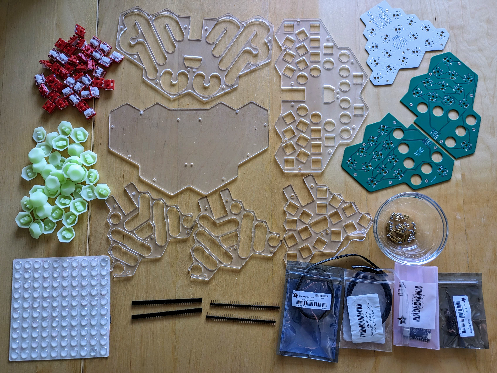
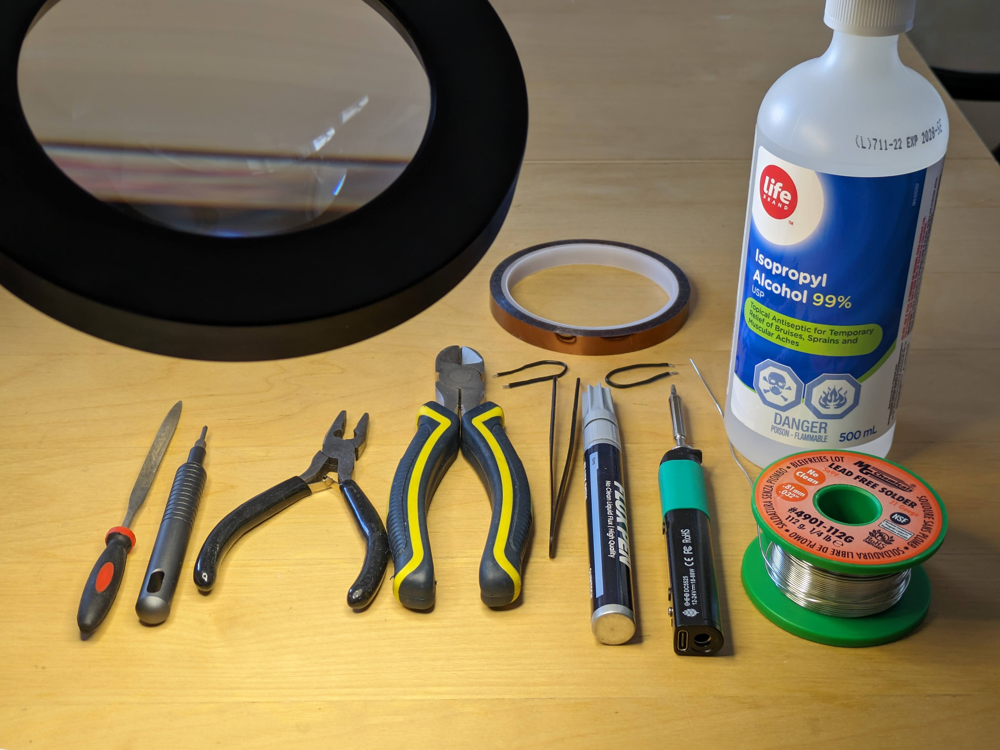
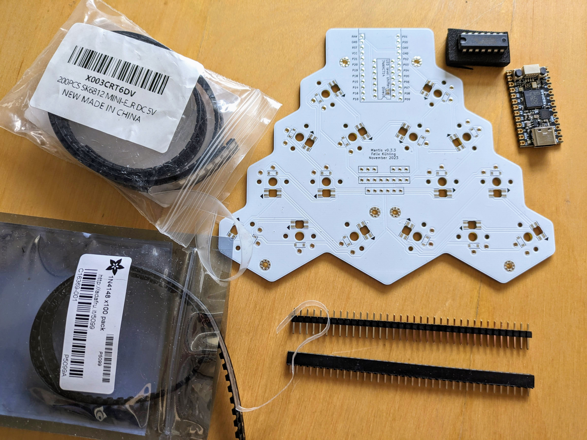
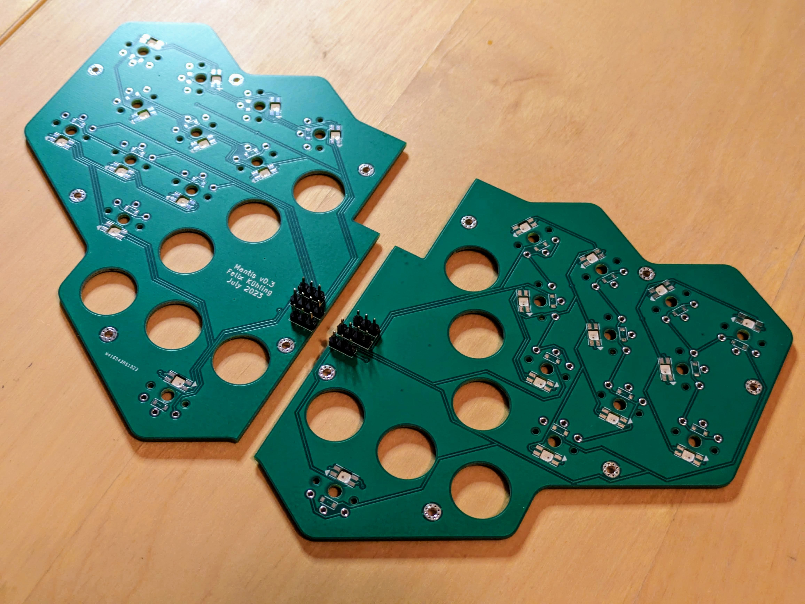
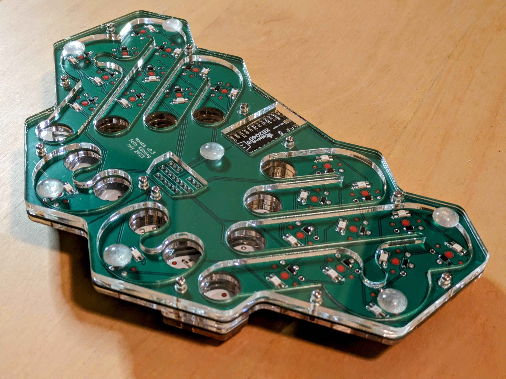
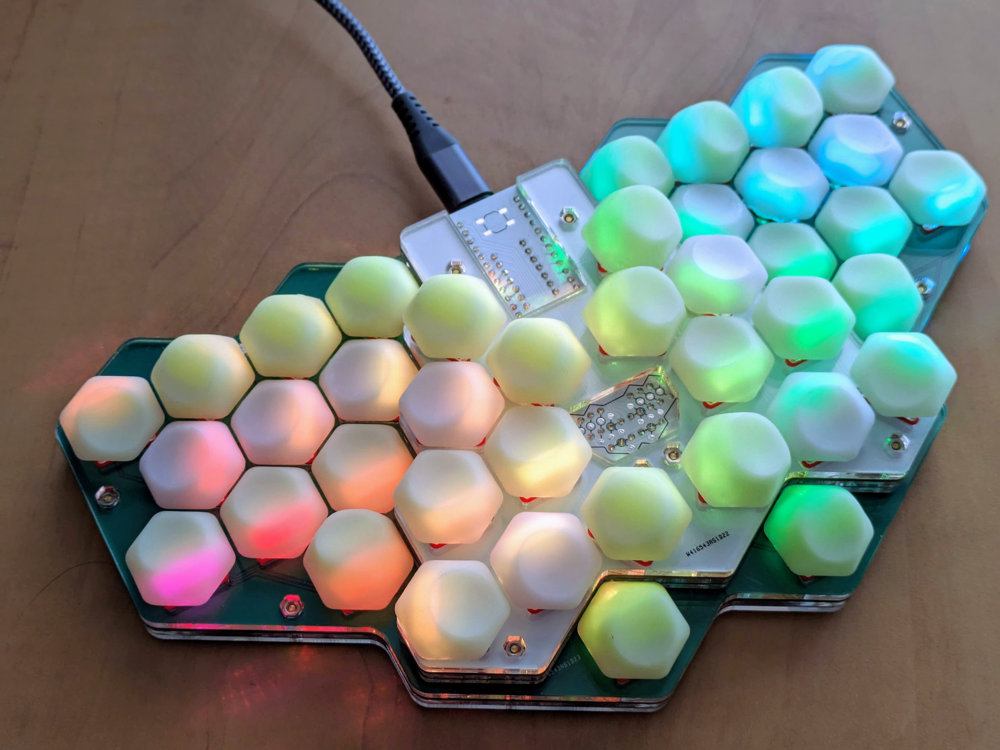

# Mantis v0.3.3 Build Guide

## Pre-requisites

Before you start, make sure you have all the parts and tools you will need to complete the build, and that you have a working QMK build environment.

### Parts

>

These are all the parts needed to build a Mantis keyboard.

- 1x upper PCB
- 2x lower PCBs
- 40x custom 3D printed keycaps (FK Keycaps Hex keys also work but not ideal)
- Case plates (3mm. If different thickness is used, you may need to use different headers and standoffs)
    - 1x base plate
    - 1x lower sound plate
    - 1x lower switch plate
    - 2x upper sound plate
    - 1x upper switch plate
- 1x ProMicro or pin-compatible controller (I used Adafruit's KB2040 in my latest builds)
- 1x Logic Level Inverter / Level Shifter (74AHCT14, only need for RGB with 3.3V controllers)
- 1x reset switch (optional, only useful with ProMicro)
- 40x SMD diodes (SOD-123)
- Up to 40x RBG LEDs (SK6812 MINI-E)
- 40x Choc v1 switches
- Headers: (I used 5mm short headers from Adafruit in my latest builds. 8mm headers work if you mount the male headers from the bottom of the lower PCBs, pushing the pins all the way through)
    - 2x 12-pin headers for controllers
    - 2x 3-pin, 1x 8-pin and 1x 6-pin headers for connecting the upper and lower PCBs
- 12x 3mm knurled M2 male-female standoffs
- 6x 9mm knurled metal M2 male-female standoffs (don't use plastic standoffs, they serve as GND connection between the PCBs)
- 12x M2 screws
- 12x M2 hex nuts
- Adhesive rubber feet

### Tools

>

You will need the following tools:

- Soldering iron (ideally digitally temperature controlled)
- Solder (I prefer lead-free solder, but leaded solder is easier to work with especially for soldering temperature-sensitive RGB LEDs)
- Flux (helps with soldering RGB LEDs)
- Rubbing alcohol (for cleaning up flux residue)
- Tweezers (for placing SMD diodes and LEDs)
- Pliers (for pulling header pins and tightening standoffs)
- Diagonal cutter (for cutting headers)
- Adhesive tape (for securing headers while soldering)
- Small file or sand paper (for adjusting standoffs)
- Small screw driver (for M2 screws in the bottom of the case)
- Paper clips (for testing the key matrix before installing the switches)

I would also recommend a magnifying glass and good lighting for placing and soldering the SMD components. I use a magnifying lamp.

## Build Process Overview

This is a breakdown of the build process. The rest of this build guide will explain each step in more detail.

1. Build and flash the firmware on the controller
    1. Get the source code
    2. Compile the firmware for your type of controller
    3. Flash the firmware to the controller
    4. Verify the firmware with Vial
2. Solder the top PCB
    1. Solder level shifter (if using 3.3V controller and RGB LEDs)
    2. Close direct jumper (if using 5V controller and RGB LEDs)
    3. Solder controller headers to PCB
    4. Socket the controller
    5. Solder diodes
    6. Solder RGB LEDs
    7. Test LEDs and diodes
3. Solder Bottom PCBs
    1. Solder diodes
    2. Solder RGB LEDs
    3. Cut and solder male headers on bottom PCBs
4. Preliminary assembly and testing
    1. Cut female headers for top PCB
    2. Align and assemble top and bottom PCBs with loose headers on top PCB
    3. Solder female headers on top PCB
    4. Test LEDs and diodes on bottom PCBs
    5. Disassemble top and bottom PCBs again
5. Switch installation and final assembly and testing
    1. Align top switch plate with top PCB and install+solder switches on top PCB
    2. Test switches on top PCB
    3. Align bottom switch plate with bottom PCBs and install+solder switches on bottom PCBs
    4. Adjust standoffs
    5. Install 9mm standoffs on top PCB assembly and align with top sound plates
    6. Align and connect bottom PCB assembly, install 3mm standoffs
    7. Test switches on bottom PCBs
    8. Align bottom switch plate and base plate, close the case
    9. Add bumpers
    10. Install key caps

## 1. Build and flash the firmware on the controller

First we'll prepare the controller with the correct firmware. This will allow you to test your work as you go along, while parts are accessible for correcting mistakes.

### 1.1 Get the source code

I will assume that you already have a QMK build environment set up. I use a Linux PC to build and flash firmware. Refer to the [QMK documentation](https://docs.qmk.fm/#/newbs_getting_started) if you haven't built QMK before.

We will add a new remote (my fork of QMK) to your local QMK git repository, create a new local tracking branch or my mantis-vial-v0.3 branch and checkout that branch. In my example I will assume that you have QMK checked out in `~/qmk_firmware`.

Before you start, make sure your ```git status``` is clean.

```
$ cd ~/qmk_firmware
$ git remote add fxkuehl https://github.com/fxkuehl/qmk_firmware
$ git fetch fxkuehl
$ git branch -t mantis-vial-v0.3 fxkuehl/mantis-vial-v0.3
$ git checkout mantis-vial-v0.3
```

### 1.2 Compile the firmware for your type of controller

Mantis should work with any controller that is pin-compatible with ProMicro and supported by QMK. You can see a complete list of supported converters for drop-in replacement controllers [in the QMK documentation](https://docs.qmk.fm/#/feature_converters). If you're using a ProMicro, you can build the firmware with

```
$ qmk compile -kb mantis -km vial
```

If you are using a drop-in replacement, choose the correct converter. In my example, I'm using a kb2040 from Adafruit:

```
$ qmk compile -kb mantis -km vial -e CONVERT_TO=kb2040
```

### 1.3 Flash the firmware to your controller

Flashing the firmware requires putting your controller into boot-loader mode. Please refer to the documentation for your controller for details. The following command should wait for your controller to enter that mode and then flash the firmware. Use the same `-e CONVERT_TO=...` option as in the `qmk compile` command above, e.g.:

```
$ qmk flash -kb mantis -km vial -e CONVERT_TO=kb2040
```

### 1.4 Verify the firmware with Vial

If you don't have Vial yet, [get.vial.today](https://get.vial.today/). You can use either the web version, if your browser supported, or download the correct package for your OS. At this point, we only want to make sure that Vial detects your controller as a "Felix Kuehling Mantis" keyboard. You should see the layout with the default keymap.

>

## 2. Solder the top PCB

>

In this part of the build we will solder most of the components on the top PCB, including the controller, diodes and RGB LEDs. We're not going to install the switches yet, though. Before we move on to the bottom PCBs, we can test that all the LEDs light up and that the diodes are installed correctly and the controller can detect all 16 keys on the top PCB.

Before starting, identify the bottom side of the top PCB (shown in the picture above), which is where all the components will be mounted. You should see the pads for the diodes and RGB LEDs, as well as silk-screen legends for the controller and level shifter.

### 2.1 Solder level shifter (if using 3.3V controller and RGB LEDs)

>

If you're using a controller with 3.3V logic and want to use RGB LEDs, you need to install the voltage level shifter to adapt the output voltage of the controller for the DIN pin of the first RGB LED. Insert the pins of the 74AHCT14 from the bottom of the PCB in the correct orientation with the notch as indicated on the silk-screen. Then solder the pins from the top of the PCB.

### 2.2 Close direct jumper (if using 5V controller and RGB LEDs)

If you just installed the level-shifter skip this step. If you are using a 5V (original ProMicro) controller and want to use RGB LEDs, you don't need a level-shifter. In that case just solder the jumper with the label "Direct" on the bottom of the PCB. This connects the controller pin directly to the first DIN pin of the first RGB LED.

### 2.3 Solder controller headers to PCB

>

The controller will be mounted using the same type of headers used to connect the top and bottom PCBs later. Insert two rows of 12-pin female headers on the bottom of the top PCB. If you need to cut 40-pin headers to the correct size, see this [tutorial](https://learn.adafruit.com/how-to-solder-headers/female-headers#cutting-female-headers-to-size-3076508).

>

Secure them with tape. Make sure they're parallel and straight before you solder them. Turn the PCB around and solder the pins from the top. The remove the tape.

### 2.4 Socket the controller

> _The following instructions assume that you're using short headers (5mm) available from Adafruit. If  you're using normal 8mm headers, there is a trick to make them work. See the section about 8mm headers in the Appendix._

>

We'll solder the corresponding male headers to the controller. Insert the long side of the male headers into the female headers already mounted on the PCB. Place the controller on the male headers so that the short side sticks through the plated through-holes on the controller with the components of the controller facing the Mantis PCB and the USB port pointing to the edge of the PCB. If your controller has 13 through-holes on each side, ignore the ones closest to the USB port (labelled D+ and D-).

>

If some components (e.g. reset switches) on the controller are too close to the header, you may need to file down the plastic part of the header to make it fit. Once you have a good fit, solder the pins to the controller.

Unplug the controller carefully from the socket to avoid bending any pins and keep it in a safe place until later.

### 2.5 Solder diodes

>

First use the soldering iron to add a small blob of solder to one pad of each diode. To make it easier to install the diodes in the correct orientation, do this on the same side for each diode. The silkscreen markings may be a bit hard to read if the silk screen isn't perfectly aligned with the solder mask (I'll use more obvious silkscreen legend on the next PCB revision). On the top PCB the bar on the diode will face towards the outer switch pin. The silkscreen outline should be closed on that side. Add the solder blob to the pad on that side for reference.

>

Now carefully place the diodes, one at a time, using tweezers. Make sure the bar on the diode is facing toward the pad where you just placed the solder blob. Melt the solder blob with the soldering iron and push the diode into place. Then remove the iron to let the solder solidify. The diode should be firmly in place now. If you need to reposition it, melt the solder again and move the diode using the tweezers.

Once you've placed all the diodes, you can revisit each diode and solder the other pin to its pad.

### 2.6 Solder RGB LEDs

LEDs add some bling to your keyboard. However, this is the trickiest part of the build, in my experience. If you overheat the LEDs, some colors may not work any more or they may be broken altogether. Also, because of the way the LEDs are chained, one broken link (bad solder joint) in the chain will affect all the downstream LEDs. The keyboard works without LEDs, so you can skip this step to save yourself time and hassle.

Soldering the LEDs is easier with leaded solder, which melts at a lower temperature. I ruined two PCBs when I tried to solder LEDs with a cheap soldering iron and lead-free solder. For best results, prepare the pads on the PCB with flux and use a decent soldering iron with good temperature control. Choose a tip that is large enough to ensure good heat transfer but small enough so you can heat one pad at a time.

Take your time with this step and take breaks if you need to. If it's not working, make sure the solder tip is clean and free of oxidation, and that the temperature is right.

>

When placing the LEDs, make sure the orientation is correct. The light-emitting side should go into the cut-out in the PCB. One of the pins is missing a corner, which should align with the arrow on the silkscreen. Place the LED into the cut-out and push it down until the pins are flush with the pads.

Melt a small amount of solder on the tip of your iron and use it to tack one pin to keep the LED in place while soldering the remaining pins. Then heat one pin and pad at a time and solder it properly. Melt the solder on the pad, not on the solder tip. It doesn't take a lot of solder to make a good connection if you're using flux to make sure the solder goes in the right place (i.e. between the pin and the pad). Rotate the PCB to help you reach each pin without melting the LED housing.

>

I like to place a few LEDs with the same orientation on the PCB at once. That way I don't need to turn the PCB as many times when soldering.

### 2.7 Test LEDs and diodes

This is a good time to plug the controller into the top PCB and connect it to your computer to test your work. You should see all the LEDs light up. If some of them are not working, check all the pins on the first LED in the chain that's off, and check the DOUT pin on the last working LED. If necessary, unplug the USB and reflow the solder on any LED pins that need it. Then try again. Repeat this until all the LEDs are lit.

>

You can test the diodes by bridging the two pads of each switch with a paper clip or short piece of stripped wire. You can use the matrix tester tab in Vial to check that all the keys are working. To unlock the matrix tester, you need to bridge two keys at once (use two paper clips or short wires). Make sure you look at the PCB from the top to hit the right keys.

If you cannot get the matrix tester unlocked, you could also set the backlight mode to one of the reactive modes in the Lighting tab in Vial. Then watch the LEDs respond every time you activate a key successfully. The last option is to just use a text editor. Keep in mind that some keys are mod-taps or modifiers and may not give you an obvious response in the text editor.

If an individual key is not working, check that the diode is soldered on both ends and installed in the right direction. If a whole row or column is not working, check the corresponding controller pins.

## 3. Solder Bottom PCBs

Now we'll move on to the bottom PCBs. These PCBs are reversible. We'll build one left and one right side by installing components on opposite sides.

### 3.1 Solder diodes

Because the bottom PCBs are reversible, you cannot use the switch pins to infer the diode directions. Orient the bar on the diode with the closed side of the diode outline on the silkscreen.

### 3.2 Solder RGB LEDs

This works the same as on the top PCB as well. Use flux, make sure your soldering iron is clean and at the right temperature. You got this!

### 3.3 Cut and solder male headers on bottom PCBs

> _The following instructions assume that you're using short headers (5mm) available from Adafruit. If  you're using normal 8mm headers, there is a trick to make them work. See the section about 8mm headers in the Appendix._

>

Each of the bottom PCBs uses three male headers to connect to the top PCB: 2x 3-pin and 1x 4-pin. Cut the headers to the right size and insert them from the top of each PCB (the opposite side of where you installed the diodes and LEDs). The plated through holes are very tight (for some reason that's how the header footprints came out in KiCad). If you need force, push on the pins, not on the plastic piece. Be careful to push the pins in straight to avoid bending them.

On the positive side, the tight holes should ensure that the pins will be straight and stay in place while soldering. Solder from the bottom.

>

## 4. Preliminary assembly and testing

In this step we will partially assemble the keyboard in order to install the female headers on the top PCB and test the LEDs and keys on the bottom PCB.

### 4.1 Cut female headers for the top PCB

You will need 2x 3-pin, 1x 6-pin and 1x 8-pin female headers.

### 4.2 Align and assemble top and bottom PCBs with loose headers on top PCB

Fasten the 9mm standoffs to the six mounting holes in the top PCB with hex nuts. The standoffs go on the bottom side. Place the top PCB bottom-side-up on your work surface. The controller should be in the socket to make sure everything will fit properly.

>

Line up the two bottom PCBs with the switch plate and insert a few switches to keep everything in place. Don't solder the switches yet. Friction should be enough to keep things in place for now. The header pins should stick up through the cutout in the middle of the switch plate. The inner edges of the two bottom PCBs should be completely flush with each other. If necessary, file down any rough edges of the male headers.

>

Loosely insert the female headers into the footprints on the top PCB. Turn over the loose bottom PCB assembly and carefully lower it on the bottom PCB. Make sure the cutout for the controller lines up correctly, that all the pins of the male headers are correctly inserted into the corresponding female headers and that the standoffs line up with the mounting holes the bottom PCB. Fasten the bottom PCBs to the standoffs with M2 screws. Make sure the two bottom PCBs are properly aligned and flush before you tighten the screws all the way.

### 4.3 Solder female headers on top PCB

Now turn the whole assembly over. Make sure that the female headers are still in place and that their pins are sticking evenly through the top PCB. If something is not looking right, disassemble the keyboard and redo the previous step.

>

Now you can solder the female headers from the top of the top PCB.

### 4.4 Test LEDs and diodes on bottom PCBs

Now, with the keyboard assembled you can plug in the USB cable. You should see the LEDs on the bottom PCBs light up. If the LEDs are flickering, you probably don't have a good ground connection. Ground is connected through the standoffs, so make sure the standoffs are in place and properly fastened.

>

Use the same procedure for diagnosing and fixing LEDs as on the top PCB. Use the matrix tester in Vial or a reactive LED mode to make sure all the keys are recognized. On the reversible switch footprint, bridge the middle pad and one of the outer ones. If individual keys are not responding, check the diode direction and connections. If whole rows or columns are not working, check the controller and header pins.

### 4.5 Disassemble top and bottom PCBs again

We need to disassemble the keyboard again before installing the switches and final assembly. This is also a good time to cleanup any leftover flux from all the PCBs.

## 5. Switch installation and final assembly and testing

We've made it through the most difficult and tedious parts of the build now. We're ready for the final assembly of the keyboard, including the case, switches and keycaps.

### 5.1 Align top switch plate with top PCB and install+solder switches on top PCB

In this step we install the top switch plate and switches on the top PCB. After this step you won't be able to remove the top switch plate without desoldering the switches. If the switch plate is still covered by protective plastic or paper films, remove them now. If you're using clear acrylic plates, avoid leaving finger prints especially on the bottom side that won't be accessible once the switches are installed.

>

The edges of laser cut plates can be sharp. One side may be sharper than the other. Place the sharp edges down towards the PCB.

Insert the switches at the corners first. Make sure the the pins are straight and line up with the through-holes before you push the switches down. Once the switch plate and PCB are aligned and held in place by the corner switches, insert the remaining switches.

>

With all the switches firmly in place, turn the assembly over. Make sure the switch pins protrude through the holes. They won't protrude much because the 3mm switch plate is a bit thicker than the bottom switch housing, but they should protrude enough to make a solder joint. Then solder the switch pins from the bottom. Heat both the pad and the pin and make sure the solder flows into the hole.

### 5.2 Test switches on the top PCB

This is a good time to test the switches you just installed. If any switches aren't working, check the solder joints and reflow the solder if needed.

### 5.3 Align bottom switch plate with bottom PCBs and install+solder switches on bottom PCBs

You already did a partial assembly of the bottom PCBs and the switch plate earlier. If the plate still had protective film on it, remove it now. Align the plate with the two bottom PCBs and insert the switches starting with the corners. The header pins should stick up through the cut-out in the center of the switch plate. If the edges of the plate are sharper on one side, turn the sharper edges down towards the PCBs. Make sure the switch pins are straight before inserting them.

>

Once all the switches are in place check the alignment of the PCBs and the switch plate. The PCBs should be flush in the middle and all the edges aligned with the switch plate. Check that all the switches are properly inserted, then solder the switch pins from the bottom.

### 5.4 Adjust standoffs

The standoffs may be slightly longer than the plates are thick by a fraction of a millimeter. In my experience, acrylic plate thickness is very accurate. Wooden plates can be off by more than 0.1mm. Over three plates that error can add up enough to be noticeable.

In order to get a case that closes firmly without any rattling plates, it may be necessary to file down the standoffs slightly. You could also choose shorter standoffs, but that risks running out of thread to engage when assembling the case.

### 5.5 Install 9mm standoffs on top PCB assembly and align with top sound plates

>

The switch plates have small hexagonal holes that should hold M2 hex nuts. Screw the 9mm standoffs through the mounting holes of the top PCB into the hex nuts. Turn the PCB with the standoffs sticking up and lower the two upper sound plates. If necessary, loosen the standoffs and tighten them after placing the sound plates.

### 5.6 Align and connect bottom PCB assembly, install 3mm standoffs

>

Turn the bottom PCB assembly up-side-down and lower it on to the bottom PCB. Make sure it's properly aligned around the controller and the standoffs, and that the pins line up with the the headers on the top PCB. Screw the 3mm standoffs through the mounting holes into the 9mm standoffs.

Fasten the remaining six 3mm standoffs with hex nuts onto the bottom PCBs.

### 5.7 Test switches on bottom PCBs

Plug in the keyboard and use the Vial Matrix Tester to make sure all the switches are working before we close the case.

### 5.8 Align bottom switch plate and base plate, close the case

>

Fit the bottom sound plate over the 3mm standoffs with the sharper edges towards the PCBs. Then add the base plate in the same way and close the case with 12 M2 screws.

### 5.9 Add Bumpers

>

Stick some rubber bumpers on the bottom of the case at the corners and one in the middle to properly support the board when installing key caps.

### 5.10 Install key caps

During keycap installation be careful to align the pegs with the slots in the switch stems. Push down evenly to avoid breaking the pegs. It a key doesn't want to go in, check the pegs for any extra support material and file it off if necessary.

If you need to remove the keys later, use a key cap puller and pull up straight.

>

The switches are rotated to give the right key profile with only one or two types of key caps. There are only two possible orientations for each key cap. If you're not sure what's the right orientation for each key, use the picture for reference.

To minimize finger movement, I recommend the taller keys in the top row (except in the outer pinky key), for the lower middle finger keys, and for the four innermost thumb keys.

## Done!

>

Congratulations on your new Mantis keyboard. I hope you will enjoy using it as much as I do!

## Appendix

### Using 8mm headers

Normal 8mm headers aren't really 8mm. If you add up the male and female side, they are about 10.5mm. That's more than the 9mm between the top and bottom PCBs that works with my choice of case plates and standoffs.

The cleanest solution is to use short 5mm headers that add up to 7.5mm. When the keyboard is assembled, the pins won't be inserted all the way. But they get inserted far enough to make a good connection. However, I have only seen 5mm headers sold by Adafruit. It's much easier to get normal 8mm headers from many sources. Here is how to make those work.

Use the female side as normal. On the male side, push the pins of the headers all the way through the plastic piece so that one end of the pin (formerly the top end) is flush with the plastic. Then insert this modified header from the opposite side of the PCB. Then solder the long pins sticking through the PCB. Be careful to avoid thick solder blobs sticking up too far, because that would make the pins hard to insert into the female side. This trick works both for the male headers in the bottom Mantis PCB, and for the controller pins.