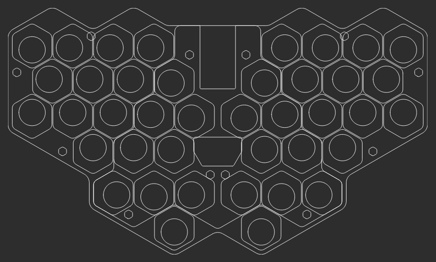
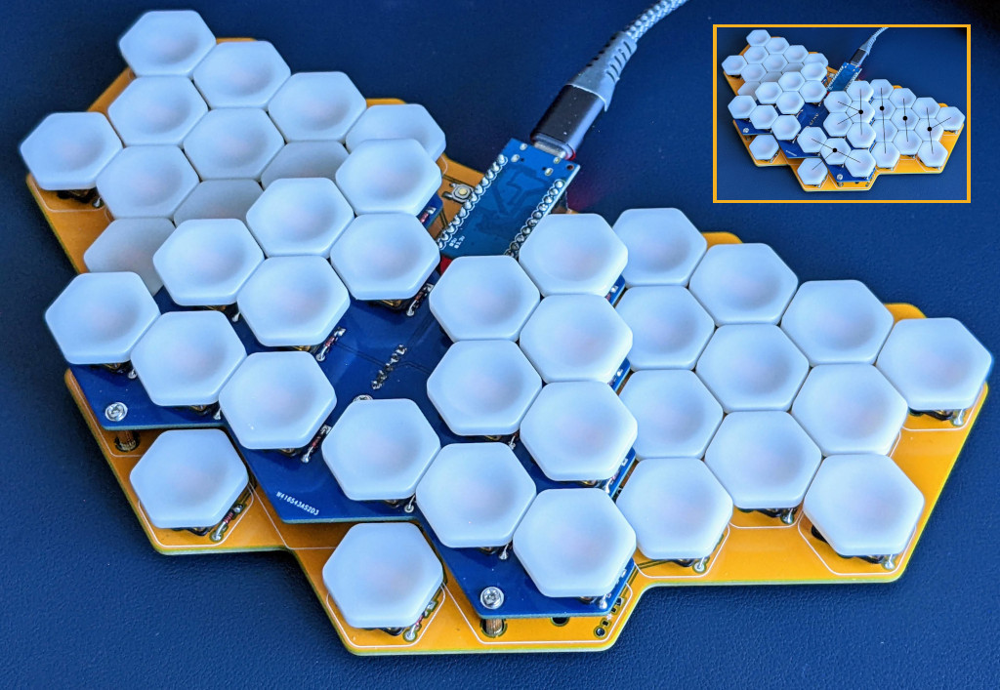
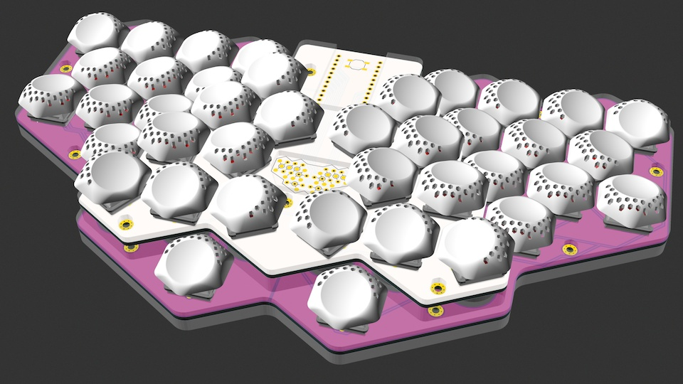
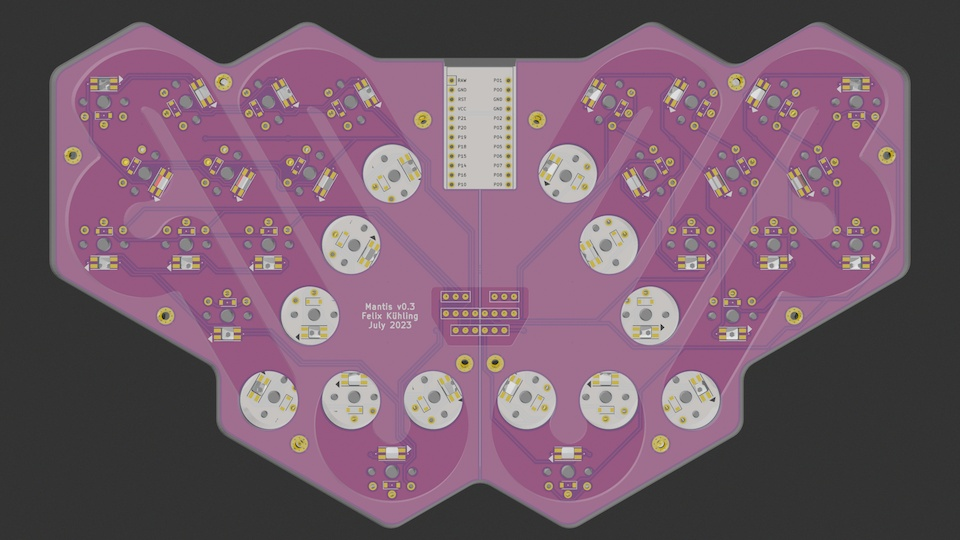

# Mantis Keyboard Design Evolution

>

>_Read the image captions below for the TL;DR ..._

When I started working on Mantis I was intrigued by the look of [hexagonal key caps](https://fkcaps.com/keycaps/hex) and their potential to create an ergonomic layout that follows from the hexagonal packing of keys. I learned to use [Ergogen](https://ergogen.cache.works/), [KiCad](https://www.kicad.org/), and eventually [OpenSCAD](https://openscad.org/), one prototype led to the next, and with v0.3 I may have created the lowest-profile, best-sounding, easiest to assemble tented unibody split keyboard with a key well that also happens to have hexagonal keys.

What all Mantis prototypes have in common are some of the original design ideas and methods used:

- Key spacing for [FK Keycaps Hex Keycaps](https://fkcaps.com/keycaps/hex)
- Unibody, 40 keys, compatible with 36-key layouts
- Column stagger and rotation of the keyboard halves resulting from the hexagonal key shape
- Layout and outlines designed with [Ergogen](https://ergogen.cache.works/)
- PCBs finished with [KiCad](https://www.kicad.org/)
- [QMK](https://qmk.fm/) firmware

Thanks to [PCBWay](https://www.pcbway.com/) for sponsoring v0.2 and v0.3 PCB production!

## February 2023 - v0.1: Proof of Concept

>

>_Hexagonal keys? Neat! I bet I can make an ergonomic unibody keyboard layout with that, where the column stagger and hand rotation follow organically from the shape of the keys. Let's build it and find out! Throw in some pinky splay too, while we're at it. With the keys resembling compound eyes, it kind of looks like the face of a praying mantis._

Version 0.1 was a proof of concept that hexagonal keys could be used to create an ergonomic unibody split keyboard layout that is actually usable. The shape of the keys results in a strong column stagger with the hands rotated 30° compared to a straight ortho-linear layout. The hexagonal packing of keys brings the columns closer together and results in the same distance of all keys from the home key of the same finger. Compared to "normal" 3x5 layouts, the index fingers lose one key that moves to the pinky instead. The pinkies get some splay in the top row.

Hot-swap sockets for switches and controller allowed easy reuse on later prototypes.

My [Reddit post](https://www.reddit.com/r/ErgoMechKeyboards/comments/116xqfr/first_prototype_of_my_ergonomic_keyboard_design/) prompted quite a spectrum of reactions (paraphrasing):

- Sexy!
- Something from an alien space ship ...
- Is this row staggered or column staggered?
- Where the heck is the home row?
- It makes my brain/hands hurt.
- Why would you want this?
- Nothing about this is ergonomic.

My verdict: v0.1 was actually usable. Coming from a Cantor Remix with 36 keys, I quickly adapted to the Mantis layout. The column stagger felt good. The pinky splay in the top row was a bit unfamiliar at first, but not bad. It took me a week or two to fully adjust to a modified Colemak-DH layout with 5 index-finger and 4 pinky keys. The large angle of the keyboard halves allows the wrists to be straight with the elbows resting on the arm-rests and the shoulders relaxed. A video of my typing looked relaxed with minimal hand and wrist movement.

v0.1 also revealed a few problems in use:

- The fourth thumb key was unusable (as expected)
- The other three thumb keys were too close together in their arc
- The outer home row pinky key was uncomfortable to reach
- Finger travel distance within the columns was quite large, though not excessive with only 3 rows to reach
- The flat key profile can lead to accidental adjacent key presses (I had the same problem with MBK key caps on my Cantor Remix)

## March 2023 - v0.2: Mantis Goes 3D

>

> _v0.1 was actually usable and comfortable. The pinky splay worked, but the outer home row pinky keys were a bit uncomfortable to reach, so v0.2 rearranges the pinky keys. Also the thumb keys were a bit close together and the optional 4th thumb key wasn't usable. Raising the center keys can fix those thumb cluster issues while adding some tenting and an approximation of a key well all at once. There are more things I want to try, but this is enough change for another prototype. Stacking two PCBs allows playing with some fun color schemes! Not all mantises are green ..._

v0.2 takes some inspiration from the [Thumbs Up!](https://www.thumbsup.shop/) keyboard. By raising the center keys, an approximation of a key well is created. Going into the 3rd dimension also offers a neat solution to the thumb cluster issues without compromising on the hexagonal key layout: By lowering the front-most thumb key, it creates a larger separation of the three keys in the arc and it makes the fourth thumb key above it usable. Other benefits:

- Index fingers can reach their keys more easily
- 10mm rise results in about 15° tenting angle to make the wrists more comfortable
- Home position is easy to find by touch

v0.2 also changed the layout of the pinky keys to avoid uncomfortable stretching to the side, which resulted in a slightly more compact layout. The bottom PCB still has all the switch footprints, so it could still be used to build a flat keyboard.

I built two prototypes to experiment with different heights and assembly methods. The top and bottom PCBs can be connected with only the headers. Optional M2 stand-offs can be used to adjust the height and make the assembly more stable. A high-profile version with 12mm rise uses 8mm headers. Adding 10mm stand-offs made it sturdier. A low-profile version with 6.6mm rise uses low profile sockets, diode legs as pins and 5mm stand-offs. The ideal may be somewhere in the middle using 8mm stand-offs and maybe 5mm headers from Adafruit.

For this version I created and over time refined a unique keymap loosely based on my earlier Kolibri layout. It takes advantage of the hexagonal layout for the positioning of arrow keys and F-keys, with numbers on the home row and the ability to switch between modified QWERTY and Colemak-DH layouts with a key combination.

## July 2023 - v0.3: Sculpted Key Caps, RGB, Case Plates

>

> _v0.2 was pretty good for daily use. I actually built two of them for home and the office, and I even took one with me while travelling. But there are some problems left to fix, and bling that needs to be added. So here comes a big redesign with lots of attention to detail: Sculpted keys optimized for touch typing, per-key RGB, an acoustically optimized acrylic case, and a split/reversible bottom PCB to reduce cost. Since I already learned OpenSCAD to create the key cap, why not render a preview of the whole keyboard with it? BTW, there is only a single key cap profile here. The shallow key well is achieved by rotating the switches in 60° increments. Try that with square keys!_

The original flat Hex key caps from FK Keycaps were designed for [music keyboards](https://fabacademy.org/2020/labs/opendot/students/sol-bekic/projects/keyboard/) and [macro pads](https://fkcaps.com/keyboards/0xC.pad). While v0.3 is still compatible with the flat Hex key caps, fixing the problems with accidental key presses and finger travel distance called for the design of 3D-printable [sculpted key caps](https://github.com/fxkuehl/mantis/blob/main/keycap/keycap.stl) with features optimized for ergonomic touch typing:

- Smaller target area with a spherical dish and defined edge
- Tilted, excentric dish oriented toward the direction of finger movement to reduce finger travel and ensure smooth key actuation by directing force towards the center of the switch stem
- Sloping sides to create more separation between adjacent keys, reducing accidental key presses
- Smooth transition from the front of the dish to the edge of the key to make it comfortable for the thumbs

The key profile is designed in OpenSCAD to make it parametric and easy to adjust and optimize. Using the general polyhedron primitive makes it possible to describe the organic shape with curved, sloping sides creating a smooth transition from the rim of the tilted spherical dish to the rounded hexagon outline of the key. A Minkowski sum with a half sphere is used to generate an even wall thickness. To allow per-key LEDs to work with opaque materials, the outside slope near the switch's LED hole features perforations to let light shine through and reflect indirectly in all key orientations.

The tilt angle of the spherical dish is 15° to match the intended tenting angle of the keyboard on the home row. On the other rows, the keys are rotated differently to match the direction of finger travel. This is achieved by rotating the switches and their PCB footprints in 60° increments. Thus only a single key cap profile is sufficient to approximate a shallow key well. Even with the sculpted profile and a 15° tilt, the keys are only 2mm taller than the original flat Hex key caps.

In addition to per-key RGB backlight, v0.3 adds a case by sandwiching laser-cut plates with the PCBs, held together with M2 stand-offs. The mid-layers are designed to optimize the acoustics of the keyboard. The resonant spaces in the top and bottom of the case are connected through openings in the PCBs and switch plates such that each keyboard half has a long channel (~50cm) winding under its keys, open to the outside on one end. The low resonant frequency (~170Hz) is meant to modulate the sound of the key strokes for a "thocky" effect. To make a continuous channel possible, hot-swap sockets had to be sacrificed; v0.3 supports only soldered switches.

The bottom PCB is split and reversible to reduce manufacturing cost. The diodes and LEDs are surface mounted on the bottom to allow the switch plates to be flush with the top of the PCBs. The controller is mounted underneath the top PCB, so it is completely hidden inside the case. The pads of the headers connecting the PCBs masquerade as a layout diagram depicting the home position and finger assignment on the silkscreen. With all the headers concentrated in the center, stand-offs and/or plates are required for stability. The stand-offs also serve as GND connection between the PCBs, required for the LEDs to work.

The LED footprints are chained to give some options for building keyboards with fewer or more LEDs:

- 6: Only the six top center keys, including the index finger home keys
- 16: Only the center PCB keys
- 40: All keys

## What's Next?

>

>_I expect to use v0.3 for a while and build a few of them as gifts for friends and family members who have expressed interest. I hope to see a few more brave enthusiasts who use the source and build their own Mantis boards. The next version may have a 3D-printed case and an integrated pointing device._

There are a few things to experiment with in v0.3 that don't need a big redesign. The sculpted key cap design is parametric. Depending on how v0.3 feels in daily use, I may play with those parameters, maybe use a few different key cap profiles on different keys. I may also change the design that lets LEDs shine through, experimenting with different materials and holes that don't penetrate all the way to the top of the key cap.

I may try out wooden case plates for a different look and sound. Maybe I can come up with a low-profile, low-noise version of the case.

For the next big revision my major open TODO-list item is an integrated pointing device. A track point or tiny trackball should fit easily. A bigger trackball or a small Cirque trackpad may be doable, though I would have to sacrifice two thumb keys to keep the overall compact layout.

I also want to look into a 3D-printed case design for a more finished look and potentially more cost effective production.