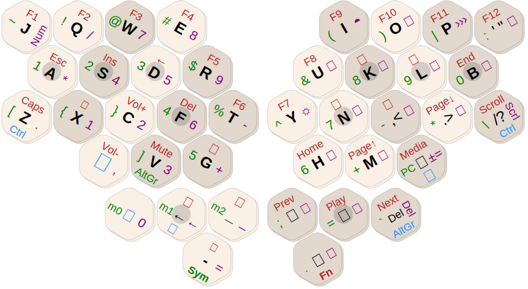

>Here is a really-quick intro to the Mantis keyboard layout. Don't let the hexagonal keys confuse you! The diagram above highlights the rotated and staggered columns with alternating shading for each finger. Dark circles indicate the home keys for each digit.

>The letter keys are mostly QWERTY but the index fingers are missing one key. Therefore **J** and **B** are moved to the pinkies. **Space** is on the right thumb home key. To provide the same functionality as a full-size keyboard, each key performs multiple jobs (colored legends):

>- Black: Alpha layer for normal letters with a (nearly) QWERTY layout
>- Purple: Locked Editing and Numpad layer
>- Green: Momentary Symbol layer with numbers and symbols
>- Red: Momentary Function layer with function, navigation and editing keys
>- Blue: Modifiers **Ctrl**, **Win/OS** (⚜), **Alt** (⎇), **Shift** (⇧), **AltGr**

>Activate the Symbol and Function layer by holding **Sym** or **Fn** respectively, just like you'd hold **Shift** to type UPPERCASE. Modifiers are also (mostly) activated by holding a key, rather than tapping it. **Fn+X** toggles the Editing and Numpad layer, relieving your thumbs.

>The Symbol layer has numbers on the home row and most shifted number symbols above. The Function layer has a navigation cluster on the right, editing keys on the left, F1-F12 across the top row. There are also six volume and media control keys. The top-right row on the Numpad layer  controls the RGB backlight animations (hold **Shift** to decrease settings): mode, hue, saturation, value, speed, on/off.

>Common combos of layers and modifiers are comfortable without twisting or moving your hands. You won't need **Shift** on the Symbol layer or **AltGr** on the Fn layer. **Alt** can be used as a one-shot mod. E.g. if you need to type **Alt+1**, tap **Alt**, then hold **Sym** and tap **1**. The Symbol layer has a second **AltGr** on the left index to combine with right thumb symbols.

>Customize the keymap for your needs with [Vial](https://get.vial.today/) (_https://get.vial.today/_). It updates the keymap on-the-fly and stores it on the keyboard itself. You'll have your custom keymap with you wherever you take your keyboard. Happy typing!